<div align="center">
  
  <h1>Molfar Vertep</h1>
  <p><b>A roleplay frontend that lives on your machine, with an agent inside who rebuilds it when you ask.</b></p>
  <p>
    
    
    
  </p>
  <p><b>English</b> · <a href="README.uk.md">Українська</a> · <a href="README.ru.md">Русский</a></p>
</div>

> [!NOTE]
> **Work in progress.** Molfar Vertep is young and changes almost every day, so you will run into bugs. That's normal at this stage: open an [issue](https://github.com/MolfarWav/Molfar.Vertep/issues) and it usually gets fixed in the next patch.
>
> **Vibe-coded, openly.** Everything we have built here since the fork, in the engine and in the Roleplay app, was written by AI agents while we described, looked and corrected; nobody typed that code by hand. That's part of the experiment: an app made by asking, which you keep changing by asking.

<p align="center">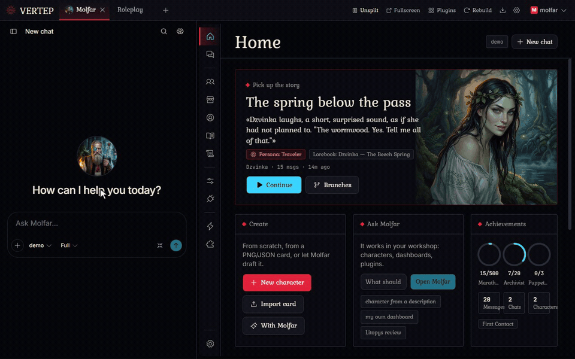</p>

## What this is

Molfar Vertep is a place for long roleplay chats with AI characters: cards, personas, lorebooks, group scenes, the usual things. It runs on your own computer or phone and opens in the browser. You bring the model: an API key, a subscription sign-in, or something running locally.


The difference is Molfar. He is the agent that lives inside, an old Carpathian sorcerer by temper, and he can change the app itself. Every app here is a folder of plain files. Tell Molfar what bothers you or what you'd like to have, and he edits those files; the screen rebuilds a few seconds later, and you look at the result right away.

## Change it by asking

<p align="center">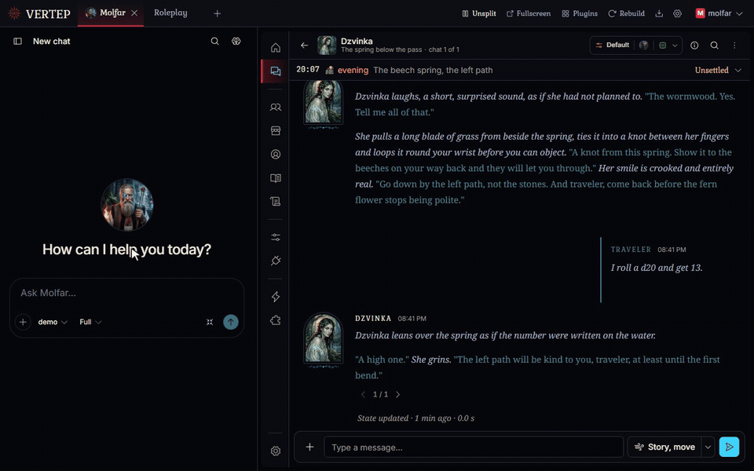</p>

Most frontends give you settings. Here you can also say "move this button", "add a dice roll", "make the chat read like a book", "show me who knows what about my character". Small fixes and whole new sections go the same way.

A few things make this comfortable rather than scary:

- **Each change can be undone.** Molfar works in git: every run leaves a checkpoint, and one click brings the code back.
- **He asks before the big stuff.** For large or unclear requests Molfar asks first, with options to pick from. Paths you mark as protected need your yes every time.
- **Your edits survive updates.** When a new version of an app comes out, it is merged with what you changed. If they clash, you choose: keep yours, take theirs, or let Molfar merge them.
- **Apps can call him too.** The Roleplay app has an "Ask Molfar" button that opens him with your request already typed. Nothing is sent until you press Send.
- **It works with small models.** Free models with a 32k window get a lighter prompt automatically, so Molfar still fits.

A good part of the Roleplay app you see below was made exactly like this: we asked Molfar, looked, asked again.

### Make Molfar your own

- **Skills.** A skill is a short instruction for one kind of task: "how I like my character cards", "how lorebooks for this world are written". Write your own, or let Molfar propose one after a task went well; nothing is saved until you say yes.
- **Projects.** Keep your chats with Molfar in projects. A project has its own instructions, skills, memory, files you add (notes, references, images) and a default model, so a chat started there already knows the context. Every installed app is a project too.
- **Memory.** Molfar keeps notes about you and your work between chats, and asks you before writing each one.

## What's already inside

**Roleplay** is the first app. The welcome screen offers it on the first start, and new versions come through the Updates button.

<table>
  <tr>
    <td width="50%">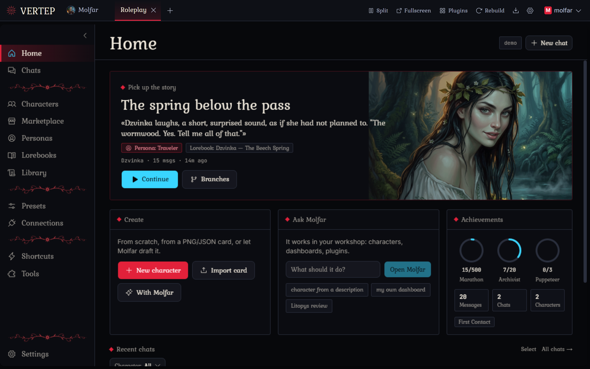</td>
    <td width="50%">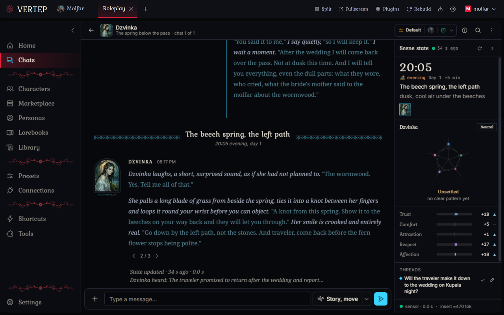</td>
  </tr>
  <tr>
    <td><b>Home.</b> Continue the last story, start a new one, find a chat by persona or character.</td>
    <td><b>Chats.</b> Reads like a book page. Swipes, branches, group scenes, edit and regenerate on any message.</td>
  </tr>
  <tr>
    <td>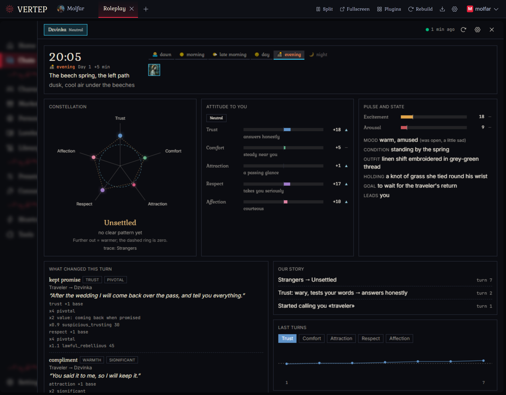</td>
    <td>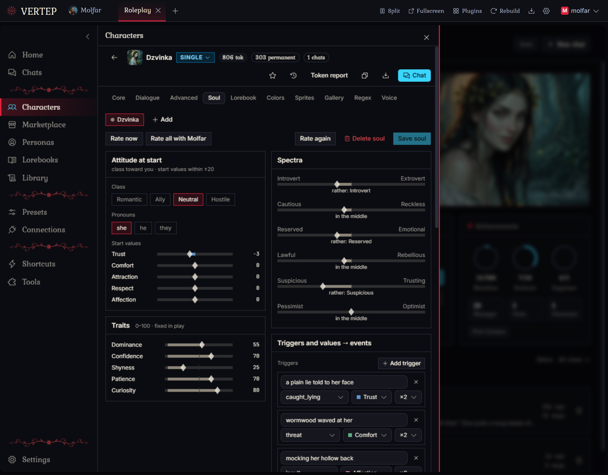</td>
  </tr>
  <tr>
    <td><b>Relationship dashboard.</b> After each reply it notes what changed: trust, mood, who learned what, where and when the scene is, which story threads are open. The characters get that back before they answer.</td>
    <td><b>Soul.</b> Each character has a temper: how fast they warm up, what hurts them, where their attitude starts. A draft is made from the card; you adjust it.</td>
  </tr>
  <tr>
    <td>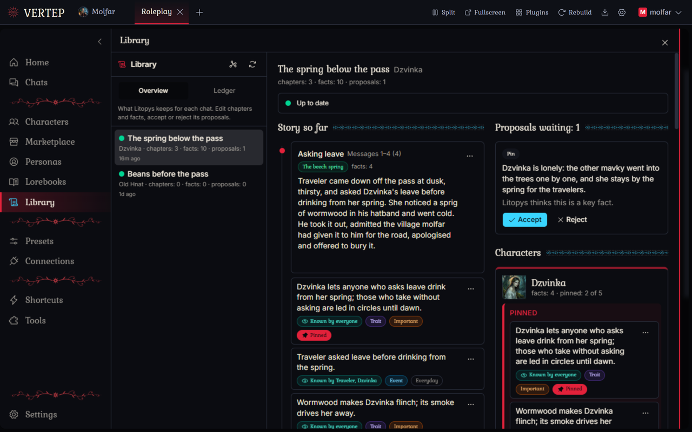</td>
    <td>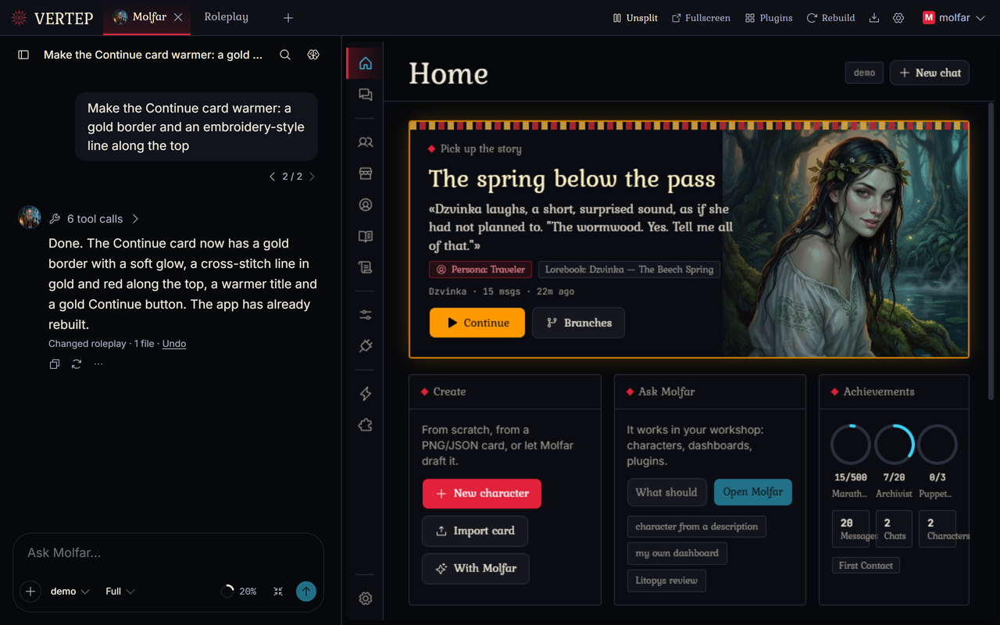</td>
  </tr>
  <tr>
    <td><b>Story memory.</b> Litopys writes a short chapter after each scene and keeps the facts: who it is about, who knows it, how much it matters. Old messages leave the prompt and the chapters stay, so a long chat still fits a small model's window. In the Library you can read and fix all of it.</td>
    <td><b>Molfar next to the app.</b> Split the screen: Molfar on one side, the app on the other, changes appear as he makes them.</td>
  </tr>
</table>

There is more in the small details: "Story, move" makes the next reply push the plot instead of just reacting to you; lorebooks match by keywords or by meaning; presets, regex scripts, personas, a data bank for long documents.

<details><summary><b>A 25-second tour</b> (5 MB GIF)</summary>
<p align="center">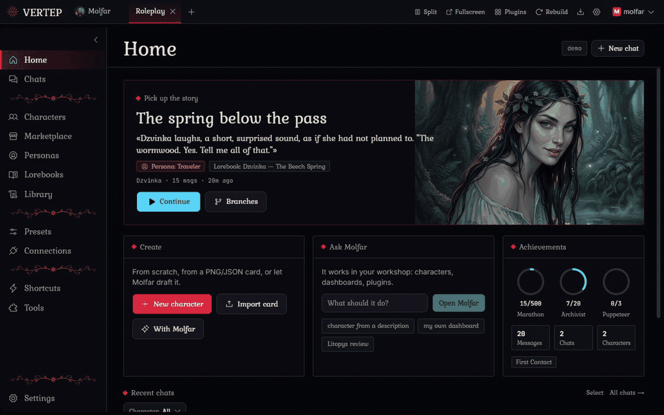</p>
</details>

<p align="center">
  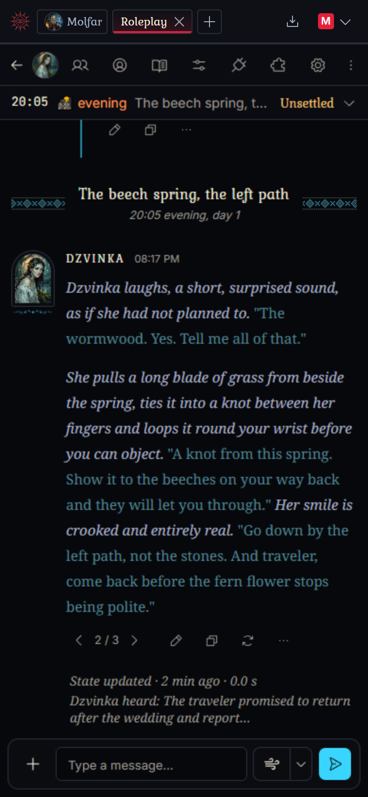
  &nbsp;
  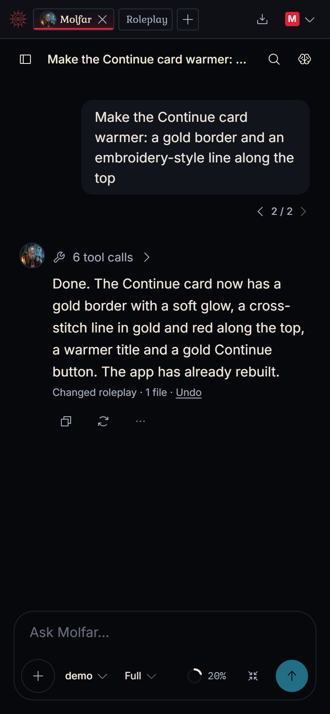
</p>
<p align="center"><sub>The same thing on a phone: open it from your computer over Wi-Fi, or install the Android app and run everything on the phone.</sub></p>

## Yours, at home

- **Runs locally.** Windows, macOS, Linux, Android, or Docker on a home server. Chats, characters and keys stay in plain files on your disk.
- **Any model.** API keys from the big providers and OpenRouter, subscription sign-ins, or any OpenAI-compatible server, including one on your own machine.
- **Apps are sandboxed.** An app from someone else shows what it wants before install (engine access, network, packages), and an update that wants more stops and asks again.
- **14 interface languages**, Ukrainian among them.
- **Free software.** AGPL-3.0. Molfar Vertep began as a fork of [Chrysalis Engine](https://github.com/ProjectChrysalis/Chrysalis-Engine) by ProjectChrysalis and has gone its own way since; see [LICENSE](LICENSE) and [CHANGELOG.md](CHANGELOG.md).

## Work in progress, and moving

This is version 0.9, and it's honest to call it early. It also moves quickly: 0.1.0 came out on October 1, 2026, and 0.9.0 a week later, twelve releases in that week. Each has notes in plain words on the [releases page](https://github.com/MolfarWav/Molfar.Vertep/releases).

Being worked on right now:

- **Molfar spends fewer tokens.** We measured where the tokens of a typical task go and cut the biggest shares: old steps get folded, files are read in batches, JSON is edited by path instead of being rewritten whole.
- **Molfar learns to write cards and presets.** Skills for creating and adapting character cards, lorebooks and presets, so a request like "turn this card into a narrator for a whole village" goes in a few steps.
- **A calmer agent page.** Reasoning and tool calls folded by default, on the desktop and on the phone.
- **Molfar's tools on Android.** Today some of them fail when everything runs on the phone.

Next in line: all model connections in one place, a small benchmark to see which models handle Molfar well, a better Chats page.

If you try it and something breaks, open an [issue](https://github.com/MolfarWav/Molfar.Vertep/issues). Ideas are welcome there too, though there is a fair chance Molfar can build yours before we get to it.

<div align="center"></div>

## Start in 5 minutes

1. Download the file for your system from the [releases page](https://github.com/MolfarWav/Molfar.Vertep/releases) (the table under **Install** below says which one).
2. Start it. Your browser opens a one-time setup page; create your account there (it is local, it never leaves your machine).
3. Add a model in **Settings > API connections**.
4. The welcome screen offers Roleplay: install it in one click. Or open Molfar and ask him for something.

<p align="center">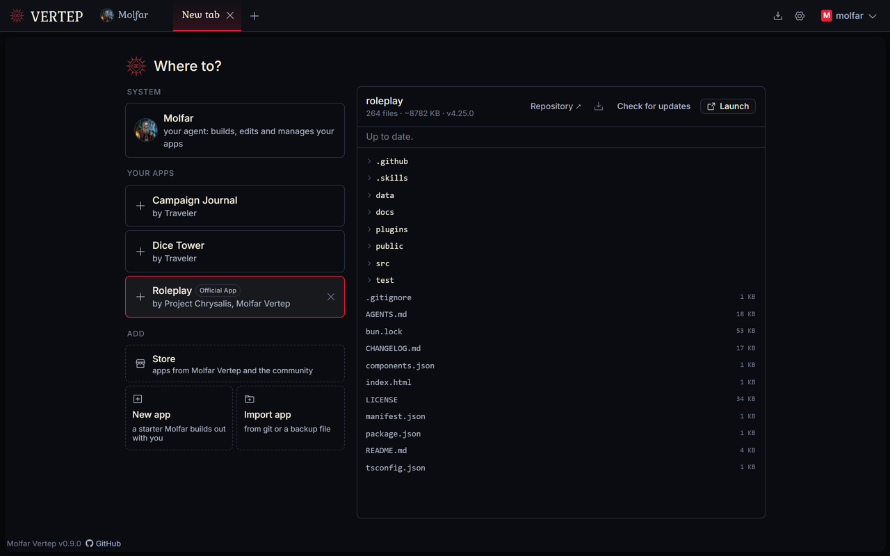</p>

---

<details><summary><b>Install — all systems</b></summary>

| System | Download | Start it |
| --- | --- | --- |
| Windows | `Molfar-Vertep-<version>-windows-x64.zip` | Unzip, double-click `chrysalis.exe` |
| macOS (Apple silicon) | `Molfar-Vertep-<version>-macos-arm64.tar.gz` | Unpack, double-click `start.command` |
| macOS (Intel) | `Molfar-Vertep-<version>-macos-x64.tar.gz` | Unpack, double-click `start.command` |
| Linux | `Molfar-Vertep-<version>-linux-x64.tar.gz` (or `-arm64`) | Unpack, run `./chrysalis` |
| Android 9+ | `Molfar-Vertep-<version>-android-arm64.apk` | Install, open the app |
| Docker (from 0.3.0) | `ghcr.io/molfarwav/molfar-vertep` | See README section below |

Releases up to 0.9.0 named their archives `Chrysalis-<version>-<system>`; self-update accepts both names since 0.8.0. Internal names stay (`chrysalis` command, `CHRYSALIS_*`, data folders) so installs keep working.

On Windows you can also run from source with one file: put `Molfar-Vertep.bat` (in the repository root) in any folder and double-click it. It installs Git and Bun if they are missing, downloads Molfar Vertep next to itself, offers each new release before installing it, builds what changed, offers a desktop shortcut and opens Molfar Vertep in your browser. `Molfar-Vertep.bat dev` follows the newest work in progress instead of releases. Folder names with spaces or in any language are fine.

On macOS, start with `start.command`, not `chrysalis`. These builds do not carry a signature macOS accepts, so opening `chrysalis` directly is blocked or closes straight away with `killed`. `start.command` clears the download flag, signs the program for that Mac and starts it; use it again after each update.

The Android APK is debug-signed, so it cannot update an installed copy: remove the old app first (export your apps' backups before that, because uninstalling deletes the app's data).

### Docker

From version 0.3.0 the release workflow publishes `ghcr.io/molfarwav/molfar-vertep` (tags `latest` and the version). Settings and data live in the `/chrysalis` volume, and the container listens on port 8788:

```sh
docker run -d --name chrysalis -p 8788:8788 -v chrysalis-data:/chrysalis \
  ghcr.io/molfarwav/molfar-vertep:latest
docker logs chrysalis        # the first start prints the setup link
```

The repository's `docker-compose.yml` does the same; `docker compose up -d --build` builds an image from your checkout instead of pulling one.

### Running from source

You need [Git](https://git-scm.com) and [Bun](https://bun.sh) 1.4 or newer.

```sh
git clone https://github.com/MolfarWav/Molfar.Vertep
cd Molfar.Vertep
bun install
(cd client-agent && bun install)
bun run build:client
bun start
```

`bun run dev` restarts on every change. `bun run test` runs the tests and `bun run typecheck` checks every project.

</details>

<details><summary><b>First start, Store, Updating, Languages, Phone</b></summary>

Molfar Vertep opens your browser (or prints a link) with a one-time setup address. Open it, create your account, and add a model connection in **Settings > API connections**. The first account is the admin: it can add more people, each with their own workspace, agent and apps.

Lost the link? It is in the window where Molfar Vertep started and in `data/logs/chrysalis.log`. Forgot a password? Stop Molfar Vertep and run `chrysalis reset-password <name>`.

The Store's list of apps comes from [MolfarWav/Molfar.Vertep-Store](https://github.com/MolfarWav/Molfar.Vertep-Store). Official apps are the ones under the MolfarWav account on GitHub, and Roleplay is one of them. Other apps are community apps: Molfar Vertep shows what they ask for (plugin permissions, network hosts, packages) and you review that before installing. A later update that asks for more stops for review again.

Apps run in a sandbox and reach the engine only through a short list of allowed calls. [SECURITY.md](SECURITY.md) describes the boundaries.

To move an app to another device, or keep a copy before uninstalling, use **Export app** in its info pane, then **Import app > Backup file** on the other side. The backup carries the app's data and keeps updating from where it came from.

Molfar Vertep keeps your data in its own folder, so an update never touches it.

- Updates button in the top bar: shows a badge when anything is newer and opens one panel with Molfar Vertep itself (for admins) and every app installed from a repository. Each row shows the current and new version, a link to the changes and an Update button; "Update all" goes through the apps one by one. If your own edits overlap with an update, you choose: keep yours, take the update, or ask the agent to merge. Checks run when Molfar Vertep starts and on "Check now". See [CHANGELOG.md](CHANGELOG.md) for details.
- Downloads (Windows, macOS, Linux, portable): the engine's update button downloads the new version, restarts and reloads the page. It is also in **Settings > Server**.
- Android: remove the old app and install the new APK (see the note above).
- Docker: `docker pull ghcr.io/molfarwav/molfar-vertep:latest`, then remove and recreate the container with the same volume.
- From source: `git pull && bun install && (cd client-agent && bun install) && bun run build:client`, then restart.

Apps you have changed are never overwritten: updating merges the new version with your edits.

The interface comes in 14 languages, including Ukrainian (Українська). Pick one in **Settings > General > Language**; it is chosen automatically from your browser's language when it is one of them.

- Molfar Vertep on your computer, phone on the same Wi-Fi: turn on *Allow other devices on my network* in Settings > Server and scan the QR code.
- Molfar Vertep on the phone itself: install the Android app. It runs the server on the phone and opens it in your browser. Uninstalling the app deletes its data, so export backups from your apps first.
- Away from home: put both devices on [Tailscale](https://tailscale.com) and use the computer's Tailscale address. `tailscale cert` gives you HTTPS files for `ssl.certPath` and `ssl.keyPath`.

</details>

<details><summary><b>Built on</b></summary>

| Project | Used for | License |
| --- | --- | --- |
| [Bun](https://bun.sh) | The runtime: HTTP and WebSocket server, bundler, package manager, test runner | MIT |
| [pi-ai / pi-agent-core](https://github.com/earendil-works/pi/tree/main/packages/ai) | The LLM kernel — provider catalog, auth formats, generation, agent loop | MIT |
| [Hono](https://hono.dev) | HTTP server and routing | MIT |
| [Model Context Protocol SDK](https://github.com/modelcontextprotocol/typescript-sdk) | Connecting to external MCP servers for agent tools | MIT |
| [QuickJS-ng](https://github.com/quickjs-ng/quickjs) via [quickjs-emscripten](https://github.com/justjake/quickjs-emscripten) | The app plugin sandbox | MIT |
| [wasmsh](https://github.com/mayflower/wasmsh) with [Pyodide](https://pyodide.org) | The agent's in-browser sandbox: an actual shell and a Python runtime, both in wasm | Apache-2.0 |
| [isomorphic-git](https://isomorphic-git.org) | Workspace version control, and installing apps from git without a git program | MIT |
| [esbuild](https://esbuild.github.io) | Bundling app frontends and app builds (WASM inside the browser builder) | MIT |
| [React](https://react.dev) | The web client shell and the agent chat UI | MIT |
| [Base UI](https://base-ui.com) | Component behaviour in the client shell | MIT |
| [assistant-ui](https://assistant-ui.com) | The agent chat UI | MIT |
| [Tailwind CSS](https://tailwindcss.com) | Styling, including the in-browser compiler for apps | MIT |
| [Phosphor Icons](https://phosphoricons.com) | Iconography in the client shell and agent UI | MIT |
| [Zod](https://zod.dev) | Schema validation | MIT |

Every other dependency is MIT, BSD, ISC, Apache-2.0, or OFL-1.1.

</details>

<details><summary><b>Workspace, settings, release builds</b></summary>

### Bring your own tools

Your whole workspace is a folder of plain files under git. Run `chrysalis workspace` in a terminal (Molfar Vertep makes itself a command the first time it starts, so there is nothing to install; open a new terminal if it was already running). It prints where the workspace is; point your editor or coding agent at it and work normally, saves reach open pages on their own. `AGENTS.md` there explains the layout to whatever agent reads it. For the parts that are not files, `./chrysalis api GET /v1/apps` calls the running engine's API.

### Settings file

Server settings live in `config.yaml`, created on first start with a note on every line. `chrysalis paths` prints where it is:

| Install | config.yaml and data |
| --- | --- |
| Windows | `%LOCALAPPDATA%\Chrysalis` |
| macOS | `~/Library/Application Support/Chrysalis` |
| Linux | `~/.local/share/chrysalis` |
| Docker | the `/chrysalis` volume |
| From source | the repository folder |

Put a `config.yaml` next to the program to keep everything in that folder instead (a portable copy, for example on a USB drive).

```yaml
port: 8788
lan: false          # true: phones and other computers on your network can open it
allowedHosts: []    # extra names, like chrysalis.home or a Tailscale name
ssl:
  enabled: false    # HTTPS: phones need it for the microphone and installing as an app
```

Admins can change the same settings in **Settings > Server**, which applies them right away, shows a QR code for your phone, and tells you when a new version is out. You can also ask the agent ("let my phone connect"); it shows you exactly what will change and waits for you to approve.

Every setting also works for a single run as an environment variable or a flag:

```sh
CHRYSALIS_PORT=9000 chrysalis
chrysalis --lan --port 9000 --no-open-browser
chrysalis --help
```

### Release builds

```sh
bun run dist                      # every platform, from any one machine
bun run dist linux-x64 windows-x64   # some of them
ANDROID_HOME=~/android-sdk bun run dist android-apk   # the APK (JDK 17+)
```

Output lands in `out/dist/`. Set `CHRYSALIS_ANDROID_KEYSTORE`, `CHRYSALIS_ANDROID_KEYSTORE_PASSWORD`, `CHRYSALIS_ANDROID_KEY_ALIAS` and `CHRYSALIS_ANDROID_KEY_PASSWORD` to sign the APK for release; keep that keystore, since Android only updates an app signed with the same key.

Releases are built by `.github/workflows/release.yml` when a `vX.Y.Z` tag that matches `package.json` is pushed on `main`. Every push and pull request runs the tests and builds every download.

</details>

## License

Licensed under the **GNU Affero General Public License v3.0 only** (AGPL-3.0-only). See [LICENSE](LICENSE) for the full text. The source is at [MolfarWav/Molfar.Vertep](https://github.com/MolfarWav/Molfar.Vertep); if you run a modified copy for other people over a network, the AGPL requires you to offer them your source.

## Inspiration

The idea comes from [pi](https://pi.dev), the minimal coding agent you adapt by asking it to build what you need. Molfar Vertep brings that idea to an AI frontend, and its agent runs on pi's own libraries.

## 💬 Support

- Bugs and questions: [GitHub issues](https://github.com/MolfarWav/Molfar.Vertep/issues).
- Security problems: private vulnerability report via the **Security** tab, not a public issue.
