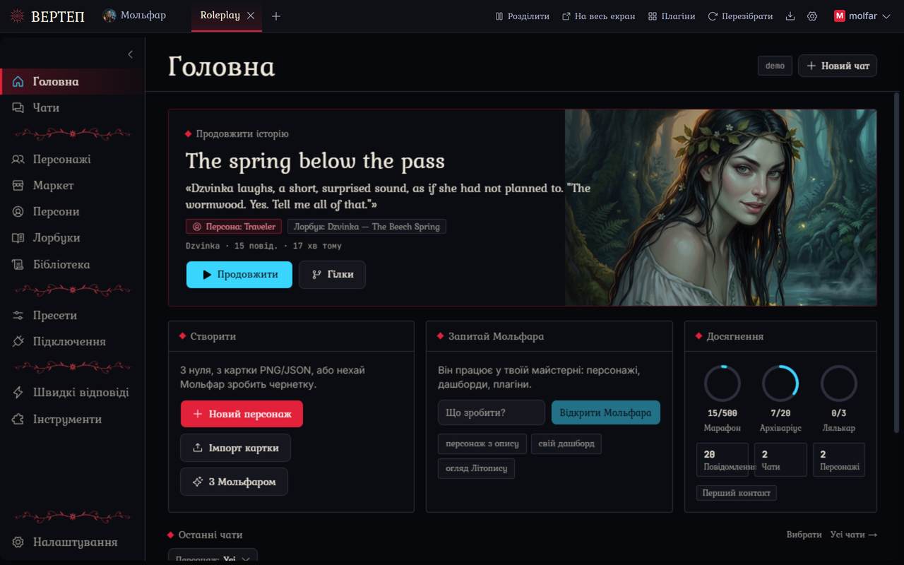

  
  <h1>Molfar Vertep</h1>
  
<b>Фронтенд для рольових ігор, що живе на твоєму комп'ютері. Усередині агент, який перебудовує його, коли попросиш.</b>

  

    
    
    
  

  
<a href="README.md">English</a> · <b>Українська</b> · <a href="README.ru.md">Русский</a>

> [!NOTE]
> **Проєкт у роботі.** Molfar Vertep молодий і змінюється мало не щодня, тож баги траплятимуться. На цьому етапі це нормально: відкрий [issue](https://github.com/MolfarWav/Molfar.Vertep/issues), і зазвичай це виправляється в наступному патчі.
>
> **Чистий вайбкодинг, і ми цього не ховаємо.** Усе, що ми зробили тут від часу форку, і в двигуні, і в Roleplay, написали ШІ-агенти, поки ми описували, дивилися й виправляли; руками цей код не набирав ніхто. Це частина експерименту: застосунок, зроблений проханнями, який ти й далі змінюєш проханнями.

## Що це таке

Molfar Vertep — це місце для довгих рольових чатів з AI-персонажами: картки, персони, лорбуки, групові сцени, усе звичне. Він працює на твоєму комп'ютері чи телефоні й відкривається в браузері. Модель підключаєш свою: API-ключ, вхід за підпискою або щось, що крутиться локально.

Уся різниця в Мольфарі. Це агент, який живе всередині (за вдачею старий карпатський мольфар), і він уміє змінювати сам застосунок. Кожен застосунок тут — це тека звичайних файлів. Скажи Мольфарові, що тобі заважає або що хочеться мати, і він відредагує ці файли; екран перебудується за кілька секунд, і ти одразу побачиш результат.

## Змінюй проханням

Більшість фронтендів дають тобі налаштування. Тут ти ще можеш сказати «перенеси цю кнопку», «додай кидок кубика», «зроби так, щоб чат читався як книжка», «покажи, хто що знає про мого персонажа». Дрібні правки й цілі нові розділи робляться так само.

Кілька речей роблять це зручним, а не страшним:

- **Кожну зміну можна відкотити.** Мольфар працює в git: кожен запуск залишає контрольну точку, і один клік повертає код назад.
- **Перед великим він питає.** Для великих або нечітких прохань Мольфар спершу питає, з варіантами на вибір. Шляхи, які ти позначив як захищені, потребують твого «так» щоразу.
- **Твої правки переживають оновлення.** Коли виходить нова версія застосунку, вона зливається з твоїми змінами. Якщо вони зачіпають одне й те саме, ти обираєш: лишити своє, взяти нове або попросити Мольфара звести їх докупи.
- **Застосунки теж можуть його покликати.** У Roleplay є кнопка «Запитай Мольфара», яка відкриває його з уже вписаним твоїм проханням. Нічого не надсилається, доки ти не натиснеш «Надіслати».
- **Працює і з малими моделями.** Безкоштовні моделі з вікном 32k автоматично отримують легший промпт, і Мольфар у нього вміщується.

Чималу частину Roleplay, який ти бачиш нижче, зробили саме так: ми просили Мольфара, дивилися, просили знову.

### Зроби Мольфара своїм

- **Навички (скіли).** Навичка — це коротка інструкція для одного типу завдань: «які картки персонажів я люблю», «як пишуться лорбуки для цього світу». Пиши свої або дозволь Мольфарові запропонувати навичку після вдалого завдання; без твого «так» нічого не зберігається.
- **Проєкти.** Тримай чати з Мольфаром у проєктах. У проєкту свої інструкції, навички, пам'ять, файли, які ти додаєш (нотатки, референси, зображення), і модель за замовчуванням, тож чат, розпочатий там, уже знає контекст. Кожен встановлений застосунок теж є проєктом.
- **Пам'ять.** Мольфар веде нотатки про тебе й твою роботу між чатами і перед кожним записом питає тебе.

## Що вже всередині

**Roleplay** — перший застосунок. Вітальний екран пропонує його при першому запуску, а нові версії приходять через кнопку «Оновлення».

<table>
  <tr>
    <td width="50%"></td>
    <td width="50%"></td>
  </tr>
  <tr>
    <td><b>Головна.</b> Продовж останню історію, почни нову, знайди чат за персоною чи персонажем.</td>
    <td><b>Чати.</b> Читається як сторінка книжки. Свайпи, гілки, групові сцени, редагування й перегенерація будь-якого повідомлення.</td>
  </tr>
  <tr>
    <td></td>
    <td></td>
  </tr>
  <tr>
    <td><b>Панель стосунків.</b> Після кожної відповіді вона занотовує, що змінилося: довіра, настрій, хто що дізнався, де й коли відбувається сцена, які сюжетні лінії відкриті. Персонажі отримують це назад перед тим, як відповісти.</td>
    <td><b>Душа.</b> У кожного персонажа є вдача: як швидко він відтає, що його ранить, з якого ставлення він починає. Чернетка створюється з картки; ти її підправляєш.</td>
  </tr>
  <tr>
    <td></td>
    <td></td>
  </tr>
  <tr>
    <td><b>Пам'ять історії.</b> Літопис пише короткий розділ після кожної сцени й зберігає факти: про кого це, хто це знає, наскільки це важливо. Старі повідомлення виходять із промпту, а розділи залишаються, тож довгий чат усе ще вміщується у вікно малої моделі. У Бібліотеці ти можеш усе це прочитати й виправити.</td>
    <td><b>Мольфар поруч із застосунком.</b> Поділи екран навпіл: Мольфар з одного боку, застосунок з іншого, і зміни з'являються, щойно він їх робить.</td>
  </tr>
</table>

А ще дрібниці: «Історія, рухайся» змушує наступну відповідь штовхати сюжет, а не лише реагувати на тебе; лорбуки спрацьовують за ключовими словами або за змістом; пресети, regex-скрипти, персони, банк даних для довгих документів.

<b>Тур за 25 секунд</b> (GIF, 5 МБ)

  
  &nbsp;
  

Те саме на телефоні: відкрий із комп'ютера через Wi-Fi або встанови застосунок для Android і запускай усе на телефоні.

## Твоє, вдома

- **Працює локально.** Windows, macOS, Linux, Android або Docker на домашньому сервері. Чати, персонажі та ключі залишаються у звичайних файлах на твоєму диску.
- **Будь-яка модель.** API-ключі від великих провайдерів і OpenRouter, вхід за підпискою або будь-який OpenAI-сумісний сервер, зокрема той, що на твоїй машині.
- **Застосунки в пісочниці.** Застосунок від когось іншого показує, що йому потрібно, перед встановленням (доступ до рушія, мережа, пакети), а оновлення, яке хоче більшого, зупиняється й питає знову.
- **14 мов інтерфейсу**, українська серед них.
- **Вільне програмне забезпечення.** AGPL-3.0. Molfar Vertep починався як форк [Chrysalis Engine](https://github.com/ProjectChrysalis/Chrysalis-Engine) від ProjectChrysalis і відтоді пішов своїм шляхом; дивись [LICENSE](LICENSE) і [CHANGELOG.md](CHANGELOG.md).

## Ще в роботі, і рухається швидко

Це версія 0.9, тож скажемо чесно: проєкт ранній. Зате живий: 0.1.0 вийшла 1 жовтня 2026 року, 0.9.0 через тиждень, і за цей тиждень вийшло дванадцять релізів. До кожного є нотатки простими словами на [сторінці релізів](https://github.com/MolfarWav/Molfar.Vertep/releases).

Зараз у роботі:

- **Мольфар витрачає менше токенів.** Ми виміряли, куди йдуть токени типового завдання, і урізали найбільші статті витрат: старі кроки згортаються, файли читаються пакетами, JSON редагується за шляхом, а не переписується цілком.
- **Мольфар вчиться писати картки й пресети.** Навички для створення й адаптації карток персонажів, лорбуків і пресетів, тож прохання на кшталт «перетвори цю картку на оповідача для цілого села» робиться за кілька кроків.
- **Спокійніша сторінка агента.** Міркування й виклики інструментів згорнуті за замовчуванням, на десктопі й на телефоні.
- **Інструменти Мольфара на Android.** Сьогодні частина з них не працює, коли все виконується на телефоні.

Далі в черзі: усі підключення моделей в одному місці, невеликий бенчмарк, щоб бачити, які моделі добре тягнуть Мольфара, краща сторінка чатів.

Якщо спробуєш і щось зламається, відкрий [issue](https://github.com/MolfarWav/Molfar.Vertep/issues). Ідеї там теж вітаються, хоча цілком імовірно, що Мольфар збудує її для тебе раніше, ніж ми до неї дійдемо.

## Почни за 5 хвилин

1. Завантаж файл для своєї системи зі [сторінки релізів](https://github.com/MolfarWav/Molfar.Vertep/releases) (яке саме — дивись таблицю в розділі **Install** [англійського README](README.md)).
2. Запусти його. Браузер відкриє одноразову сторінку налаштування; створи там свій акаунт (він локальний, ніколи не залишає твою машину).
3. Додай модель у **Налаштування > Підключення API**.
4. Вітальний екран пропонує Roleplay: встанови його одним кліком. Або відкрий Мольфара й попроси його про щось.

Встановлення на всі системи, Docker, запуск із вихідного коду, налаштування і ліцензія описані в [англійському README](README.md).
